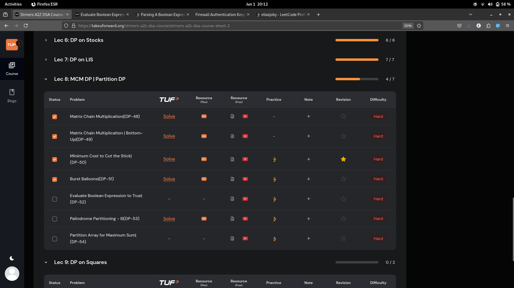
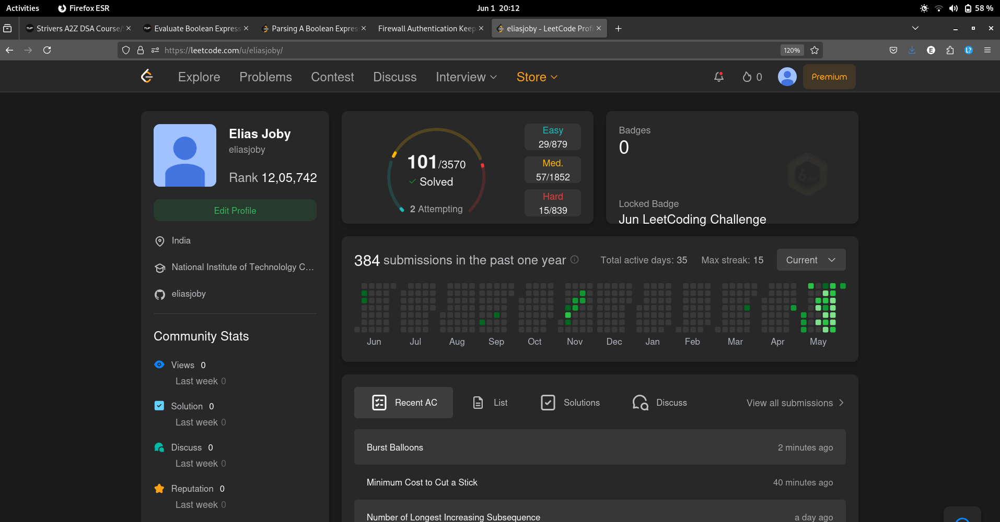

# 1-Jun-2025

## Topic Studied
Dynamic Programming

## Tasks Done

- Solved 4 qns from Strivers on MCM and Partition DP

## Notes / Reflections
- Finish Lec-8,9 completely tomorrow

## Screenshot

