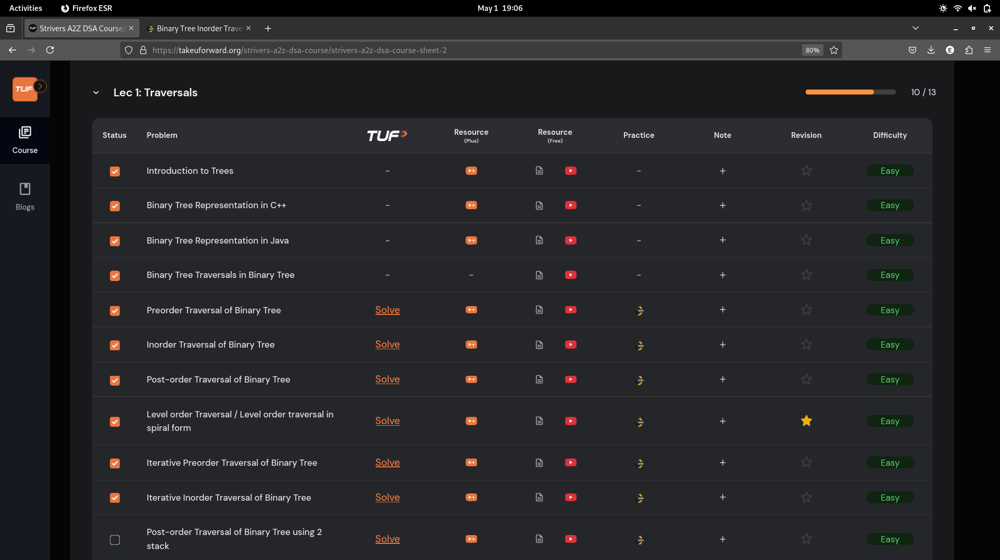
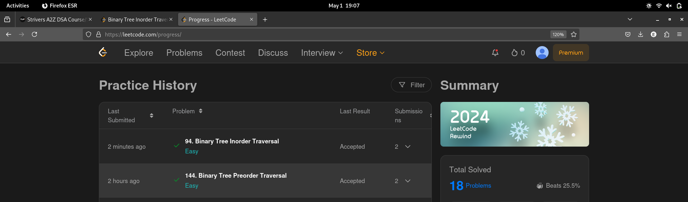

# 1-May-2025

## Topic Studied
Binary Tree

## Tasks Done
- Revised all previously learnt Binary tree algorithms

- Learnt and analysed Iterative approach of BT traversals-> Preorder and Inorder

- Solved 2 leetcode pblms

->Preorder Traversal (Iterative)
->Postorder Traversal (Iterative)

## Notes / Reflections
- Cover Iterative approach of postorder using 1 stack and 2 stack approach tomorrow
- Solve Medium level problems of BT tomorrow

## Screenshot

