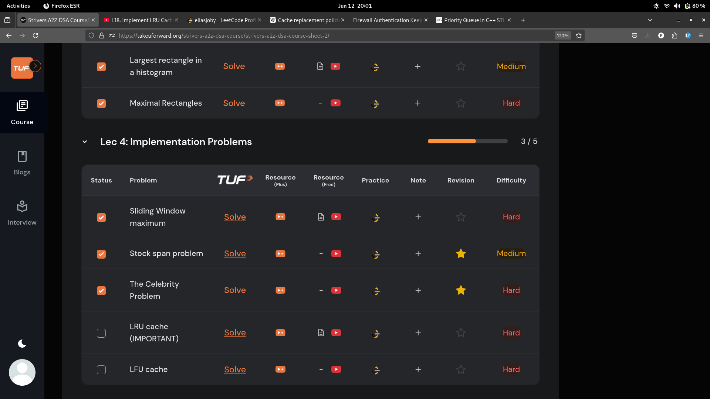
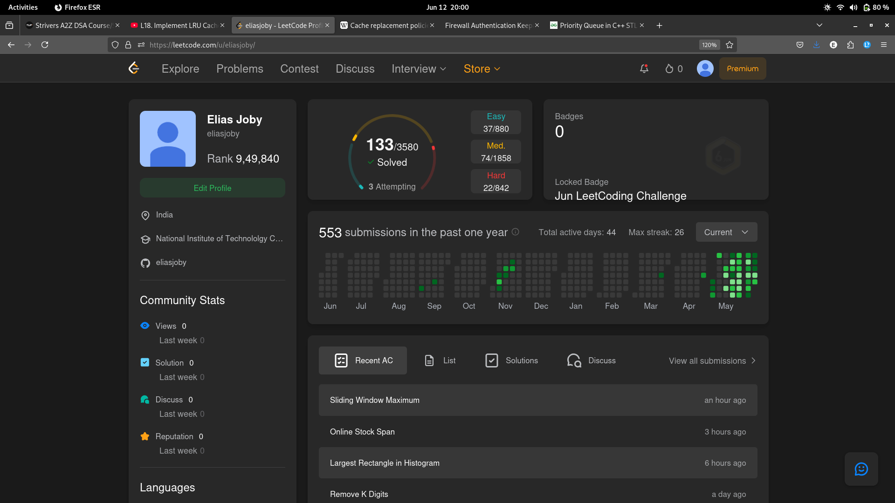

# 12-Jun-2025

## Topic Studied
Stack and Queue

## Tasks Done

- Covered 5 questions

## Notes / Reflections
- Didn’t start Bit Manipulation 
- Do the LRU and LFU cache pblms tomorrow
- Start Recursion tomorrow

-BackLog Tracking:-
1.Heaps
2.Sliding Windows
3.Bit manipulation

## Screenshot

 
