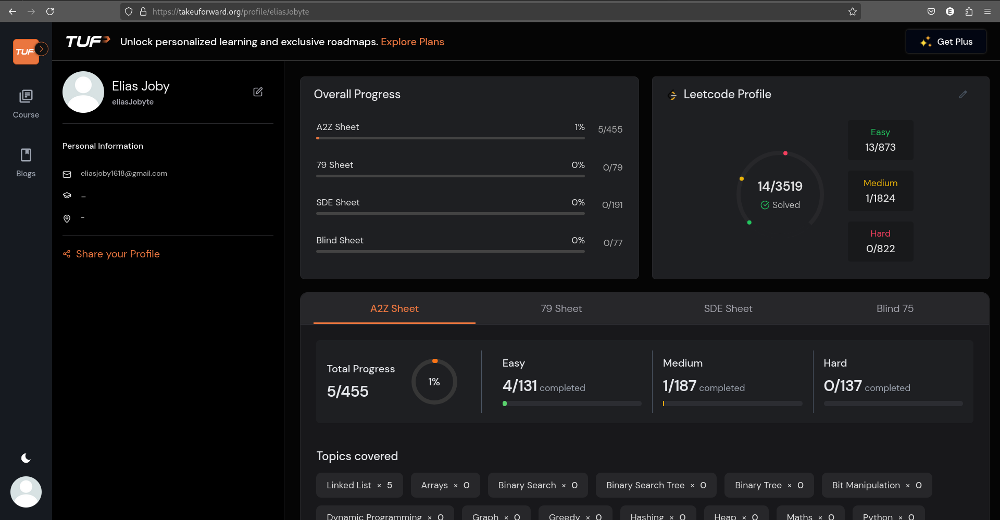

# 13-Apr-2025

## Tasks Done
- Solved 2 problems from Striver
- Revised OOPS from W3Schools

## Screenshot

## Notes / Reflections
- Felt more confident with usage of OOPS
- Want to revise basic BT algm and learn the remaining medium level algm

