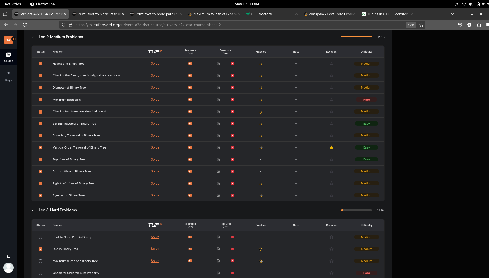

# 30-Apr-2025

## Topic Studied
Binary Tree

## Tasks Done

- Solved 5 problems from Striver's 
- Qns->Boundary Traversal->Vertical ordered traversal->Bottom View of BT->Left/Right View of BT

## Notes / Reflections
- Focus on consistency and a target 10 qns daily (3 easy+5 medium+2 hard)

## Screenshot

