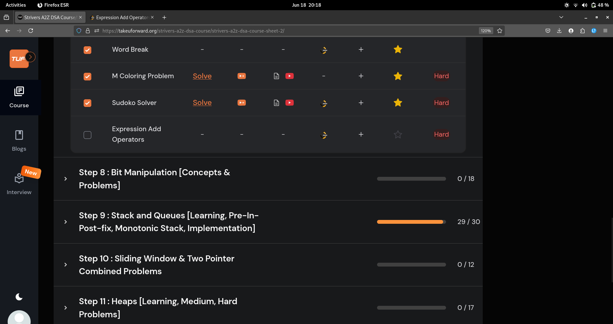
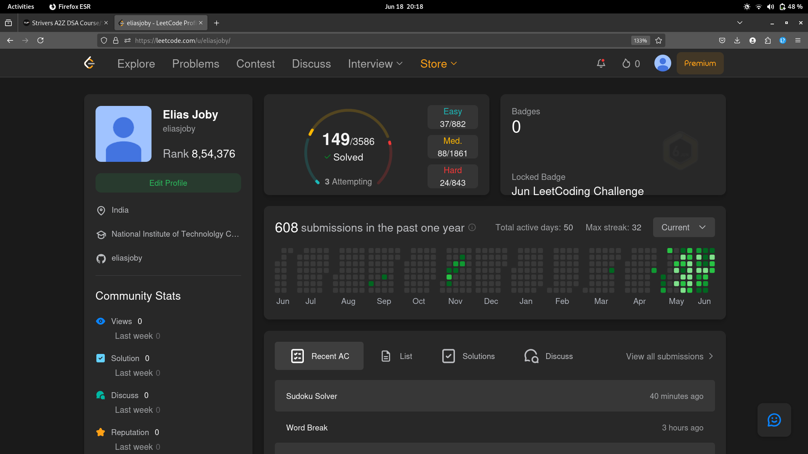

# 18-Jun-2025

## Topic Studied
Recursion

## Tasks Done

- Covered 3 questions

## Notes / Reflections
- Finish Recursion and Strings

-BackLog Tracking:-
1.Heaps
2.Sliding Windows
3.Bit manipulation
4.Strings
4.Binary Search

## Screenshot

 
