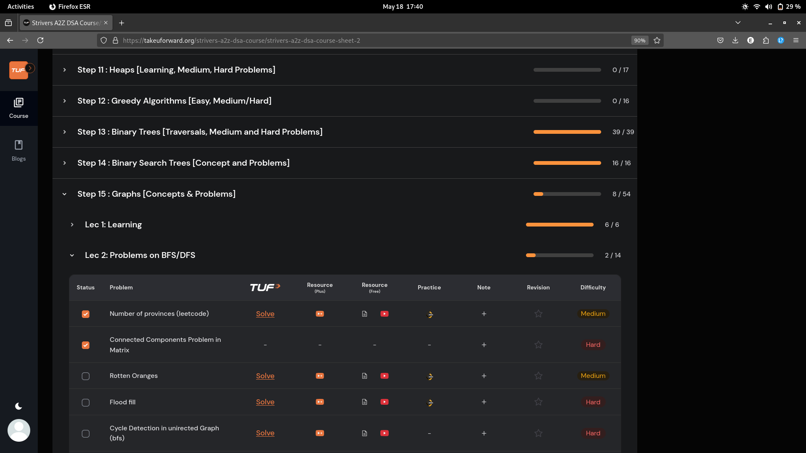
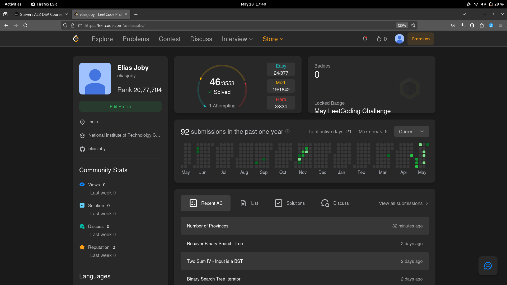

# 18-May-2025

## Topic Studied
Graph

## Tasks Done

- Learnt how to implement Graph in C++
- BFS and DFS
- Did 2 pblms from strivers

## Notes / Reflections
- Finish the bfs+dfs related qns 
- Postponing Red-Black trees topic to after completing graphs
- Learn Topo Sort+Khans tmrw and attempt the qns too

## Screenshot

