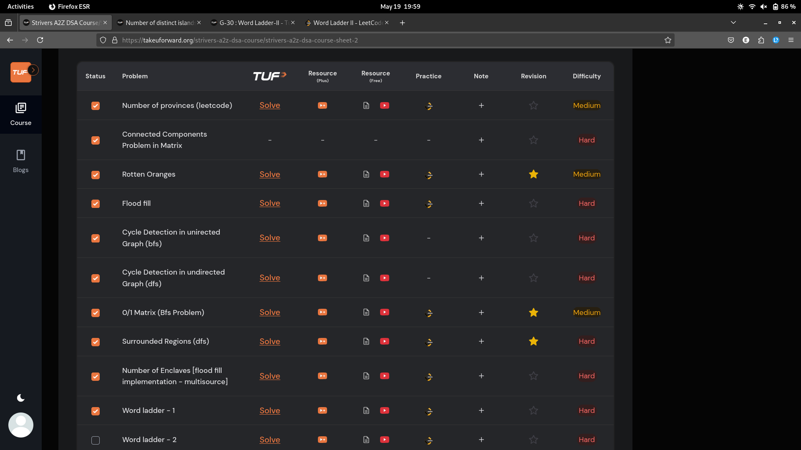
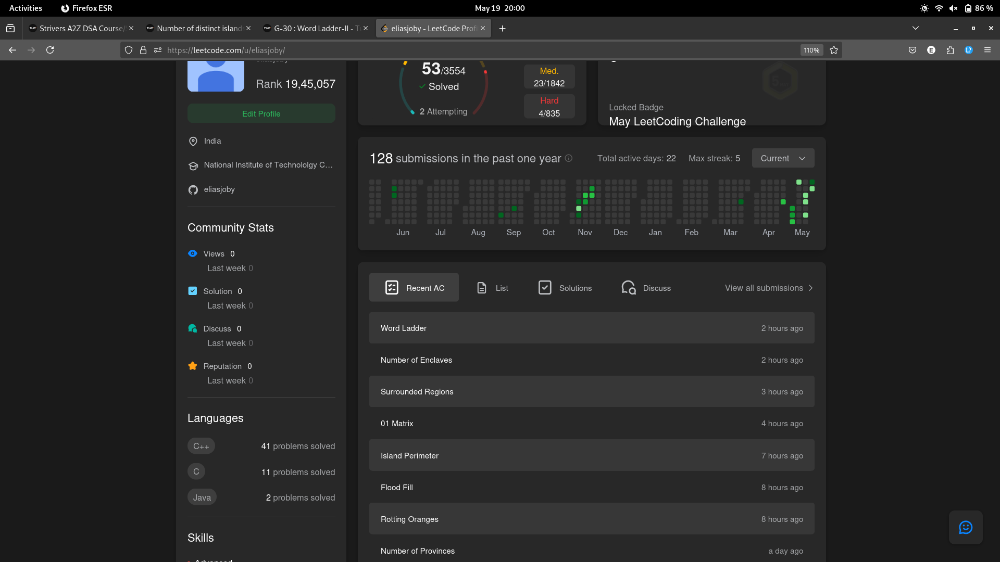

# 19-May-2025

## Topic Studied
BFS and DFS

## Tasks Done

- Attempted 9 qns from Strivers
- Studied how to detect Cycle in graph with bfs/dfs

## Notes / Reflections
- Finish the bfs+dfs related qns 
- Learn Topo Sort+Khans tmrw and attempt the qns too

## Screenshot

