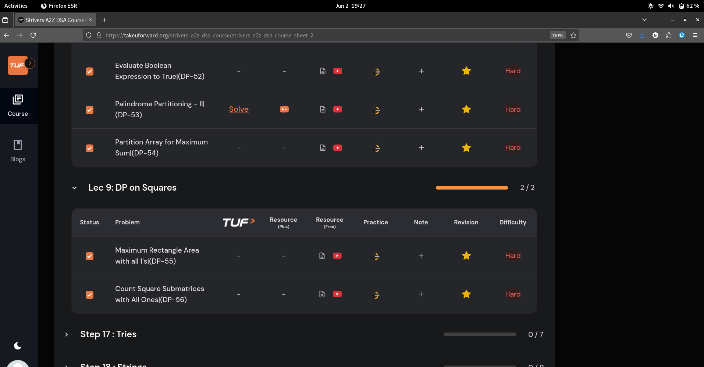
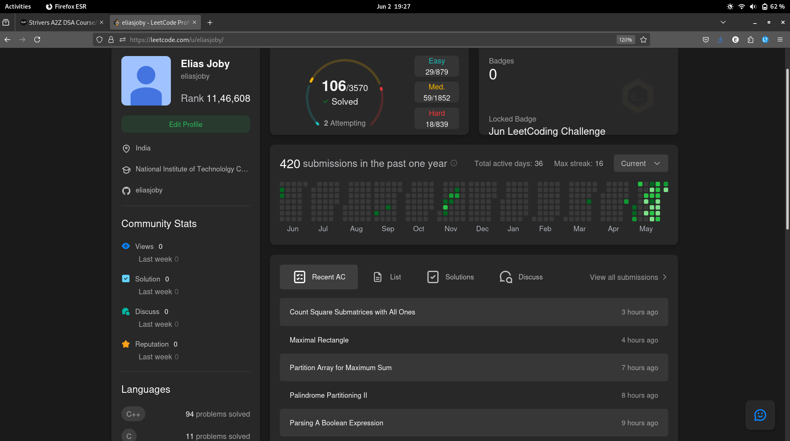

# 2-Jun-2025

## Topic Studied
Dynamic Programming

## Tasks Done

- Solved 5 qns from Strivers from Partition dp and DP on squares

## Notes / Reflections
- Revise Lec-2,3,4 from graphs
- Start Trie data structure only after completing the revision

## Screenshot

