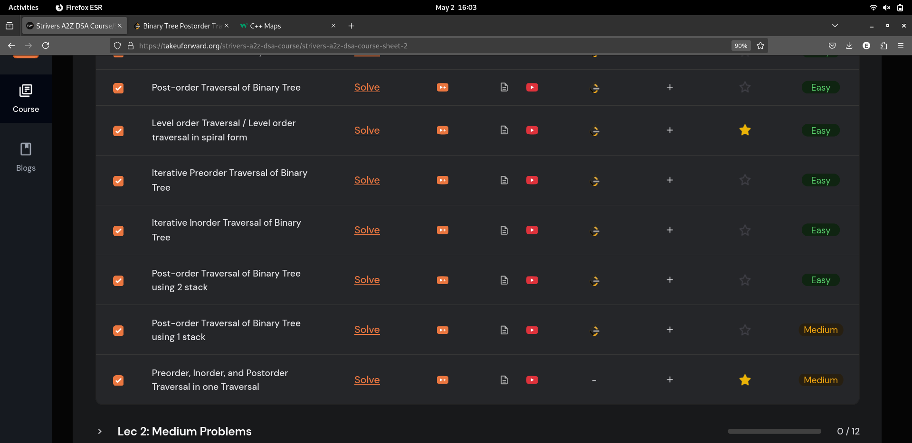
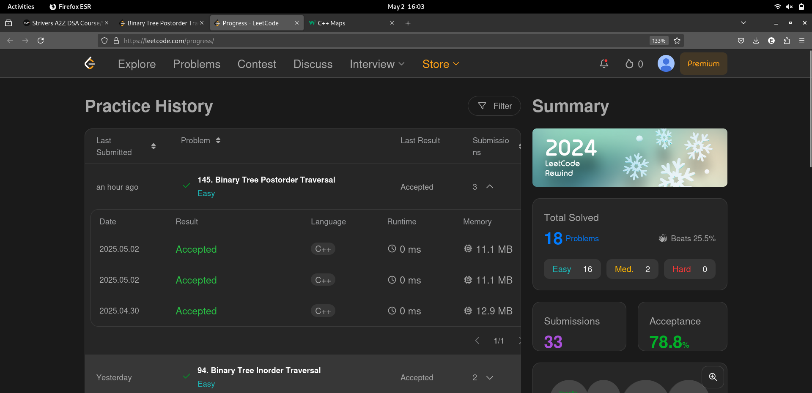

# 2-May-2025

## Topic Studied
Binary Tree

## Tasks Done

- Learnt and analysed Iterative approach of BT traversals-> PostOrder

- Re-solved Postorder Traversal using 2 stack and 1 stack approach

- Learnt 3 Traversals in one iteration approach

## Notes / Reflections
- Solve Medium level problems of BT tomorrow

## Screenshot

