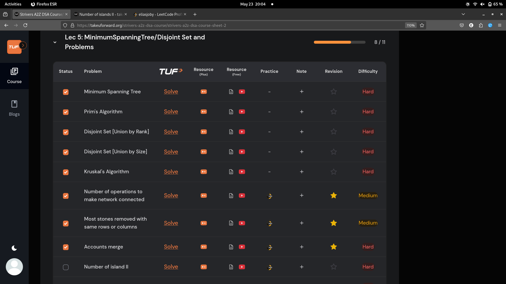
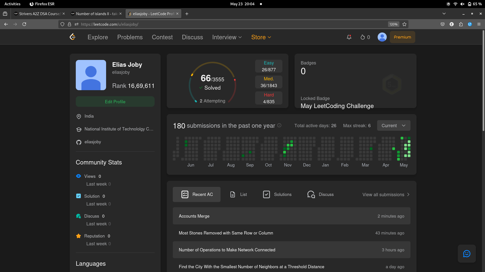

# 23-May-2025

## Topic Studied
Graphs

## Tasks Done

- Studied Prims algm + Kruskals Algm + Disjoint Set technique
- Solved 7 pblms from strivers

## Notes / Reflections
- Finish Lec-5 and Lec-6 algorithms tomorrow

## Screenshot

