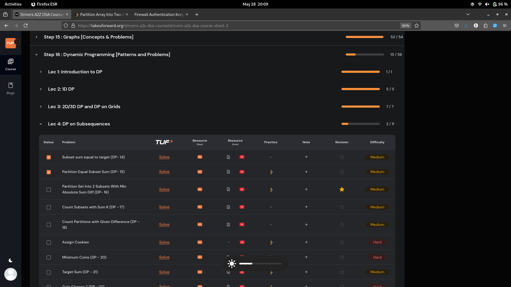
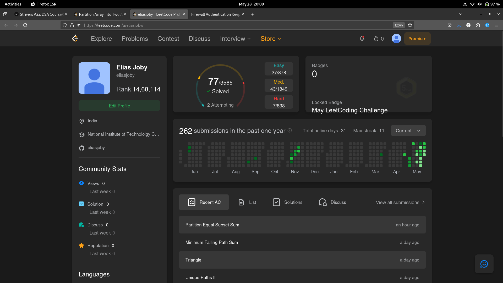

# 28-May-2025

## Topic Studied
Dynamic Programming

## Tasks Done

- Solved 3 qns from Strivers of using DP in subsequences 
- Not able to pass all the edge cases in the 3rd qn in leetcode, deal with it tmrw at the end of Lec-4

## Notes / Reflections
- Finish Lec-4 tmrw

## Screenshot

