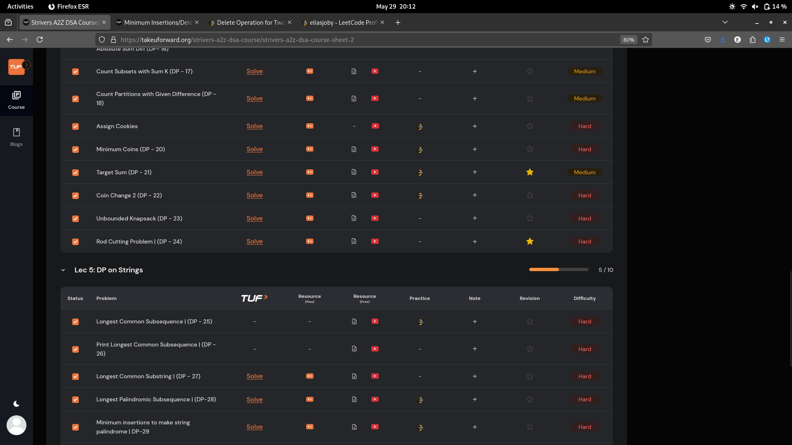
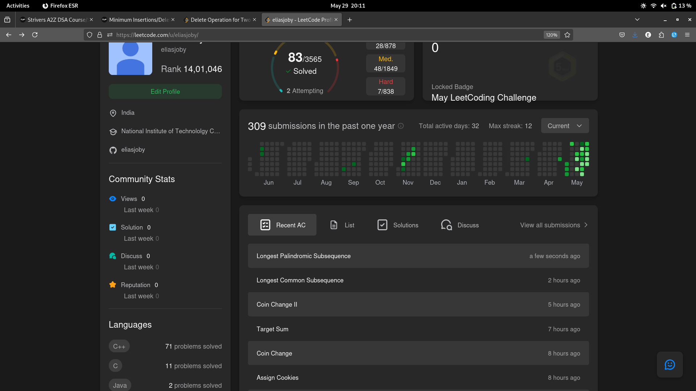

# 29-May-2025

## Topic Studied
Dynamic Programming

## Tasks Done

- Solved 8 qns from Strivers of using DP in subsequences
- Solved 5 qns from DP on strings

## Notes / Reflections
- Finish Lec-5 remaining qns and Lec-6 tmrw

## Screenshot

