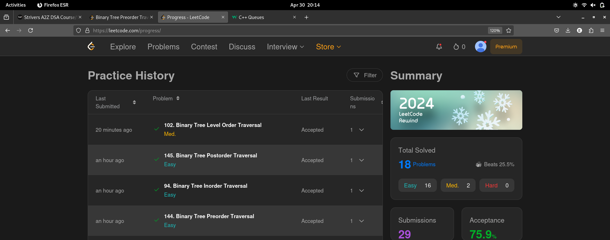

# 30-Apr-2025

## Topic Studied
Binary Tree

## Tasks Done
->Covered algorithms of basic BT problems
    -diameter
    -subtree check
    -top view
    -kth level
    -lowest common ancestor
    -min dist b/w nodes
    -kth ancestor of a node
    -Transform BT into Sum tree

->Learnt C++ implementation of BT

->Solved 5 leetcode pblms
    -Recursive Traversals (Pre,In,Post)
    -Level Order Traversal

## Notes / Reflections
- Revision of Algorithms learnt needed
- Cover Iterative approach of traversal using stack tmrw

## Screenshot

