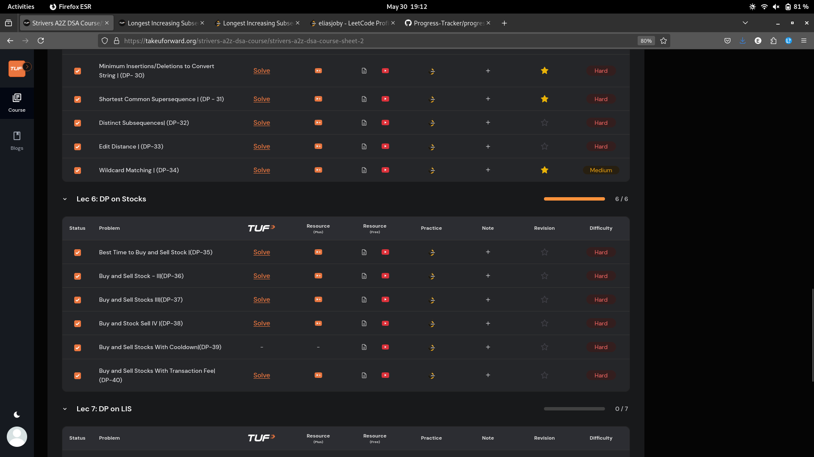
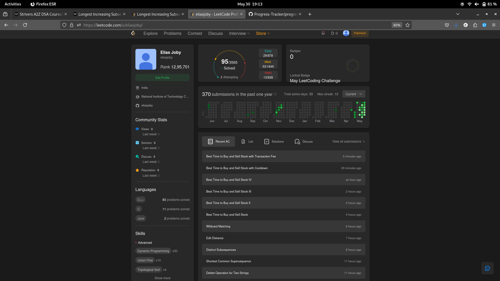

# 30-May-2025

## Topic Studied
Dynamic Programming

## Tasks Done

- Solved 5 qns from Strivers of using DP in strings
- Solved 6 qns from DP on stocks

## Notes / Reflections
- Finish Lec-7 remaining qns and start Lec-8 tmrw

## Screenshot

