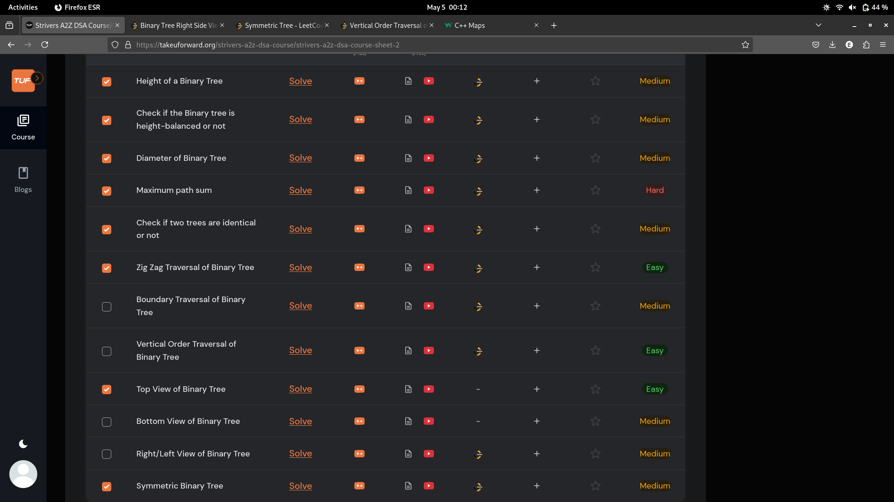
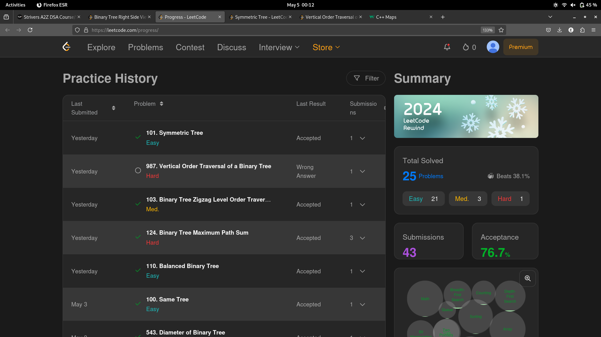

# 4-May-2025

## Topic Studied
Binary Tree

## Tasks Done

- Solved 5 problems from Striver's 
- Qns->Maximum Path Sum->Zig Zag ordered traversal->Balanced BT->Symmetric Tree

## Notes / Reflections
- Target Solving a minimum of 8 qns everyday

## Screenshot

